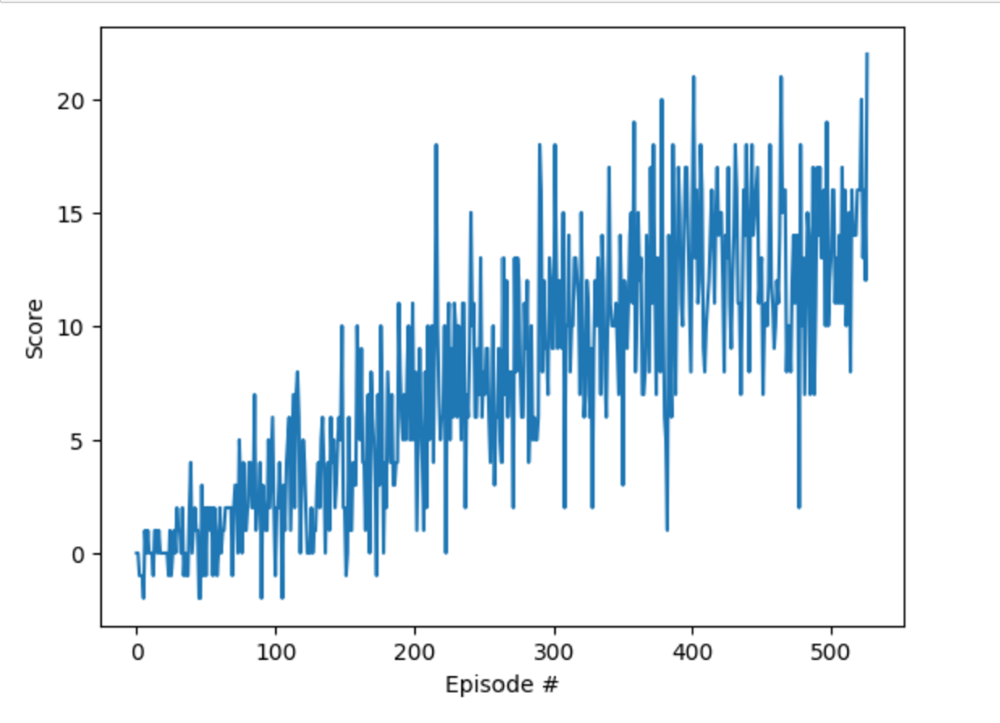

# Results

## Learning Algorithm

The agent uses a Deep Q-Network (DQN) to solve the environment. The DQN is a value-based reinforcement learning algorithm that uses a neural network to approximate the Q-function. The Q-function is a function that takes the state and action as input and returns the expected reward for taking that action in that state. The neural network is trained using the Bellman equation:

```python
Q(s, a) = r + γ * max_a' Q(s', a')
```

where `Q(s, a)` is the Q-value for state `s` and action `a`, `r` is the reward for taking action `a` in state `s`, `γ` is the discount factor, `s'` is the next state, and `a'` is the next action.

The DQN uses an experience replay buffer to store the agent's experiences. The agent samples a batch of experiences from the replay buffer and uses them to update the neural network. The DQN also uses a target network to stabilize the learning process. The target network is a copy of the neural network that is updated less frequently.

The agent uses an epsilon-greedy policy to explore the environment. The epsilon-greedy policy selects a random action with probability epsilon and the action with the highest Q-value with probability 1-epsilon.

The agent uses the following hyperparameters:

- Buffer size: 1e5
- Batch size: 64
- Gamma: 0.99
- Tau: 1e-3
- Learning rate: 5e-4
- Update frequency: 4
- Epsilon start: 1.0
- Epsilon end: 0.01
- Epsilon decay: 0.995

## Plot of Rewards

The agent was able to solve the environment in 500 episodes. The plot below shows the score of the agent over the episodes.



## Future Work

There are several ways to improve the performance of the agent:

1. Implement Prioritized Experience Replay
2. Implement Double DQN
3. Implement Dueling DQN
4. Implement Noisy DQN
5. Implement Rainbow DQN

## References

1. [Human-level control through deep reinforcement learning](https://storage.googleapis.com/deepmind-media/dqn/DQNNaturePaper.pdf)
2. [Rainbow: Combining Improvements in Deep Reinforcement Learning](https://arxiv.org/abs/1710.02298)
3. [Dueling Network Architectures for Deep Reinforcement Learning](https://arxiv.org/abs/1511.06581)